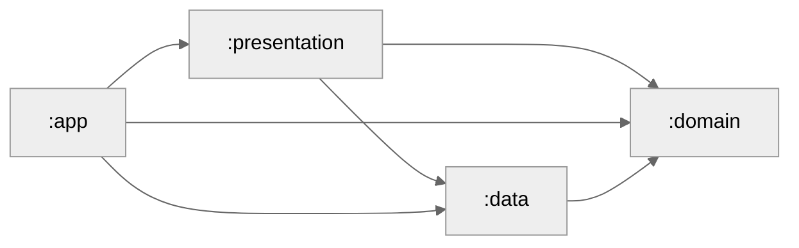

# NewsBuzz App 📱
The NewsBuzz app is designed using Jetpack Compose and adheres to Clean Architecture principles, specifically the MVVM pattern. It leverages Paging 3 for efficient data loading, Retrofit for seamless network operations, and Dagger Hilt for dependency injection, ensuring optimal performance and a modern development experience. The app's modular structure enhances maintainability and scalability.

## Features Implemented

- Display news in a list
- Display news details in webview

  ## Major Highlights
- **Jetpack Compose** for modern UI
- **MVVM architecture combined with Clean Architecture with modular structure** ensures a maintainability and scalability codebase.
- **Kotlin**
- **Dagger Hilt** for efficient dependency injection.
- **Retrofit** for seamless networking
- **Coroutines** for asynchronous programming
- **Unit tests** for robust code coverage
- **Navigation** for smooth transitions between screens

### Project Structure

#### Data Layer

The data layer holds the application data, including remote data sources. It depends on the domain layer to implement domain contracts. I wrote tests for the PagingSource in this layer.

#### Domain Layer

The domain layer contains the business logic, including repositories, models, and use cases. I wrote tests for the use cases in this layer.

#### Presentation Layer

The presentation layer contains the screens and their viewmodels. I followed the MVVM pattern here. I chose to use separate data models for the presentation layer rather than the domain models.

### Module Graph



Here's a breakdown of the module dependencies:
- `app` depends on `data`, `domain`, `presentation`.
- `presentation` depends on `domain`,`data`.
- `data` depends on `domain`.

### Testing
- I wrote tests for the `PagingSource` in the data layer.
- I wrote tests for the `usecases` in the domain layer.
- I wrote tests for the `viewmodels` in the presentation layer.
- I wrote tests for the UI in the presentation layer.
- I wrote some tests for navigation.

### Libraries
- [Jetpack Compose](https://developer.android.com/jetpack/compose) - Modern toolkit for building native UI
- [Retrofit](https://square.github.io/retrofit/) - A type-safe HTTP client for Android and Java
- [Hilt](https://developer.android.com/training/dependency-injection/hilt-android) - Dependency injection library for Android that reduces the boilerplate of doing manual dependency injection in your project
- [Coil](https://coil-kt.github.io/coil/) - An image loading library for Android backed by Kotlin Coroutines
- [Type Safe Navigation](https://developer.android.com/guide/navigation/design/type-safety) - Type safety in Kotlin DSL and Navigation Compose
- [Coroutines](https://developer.android.com/kotlin/coroutines) - For managing background threads with simplified code and reducing needs for callbacks
- [Flow](https://kotlinlang.org/docs/flow.html) - A cold asynchronous data stream that sequentially emits values and completes normally or with an exception
- [Paging 3](https://developer.android.com/topic/libraries/architecture/paging/v3-overview) - The Paging library helps you load and display pages of data from a larger dataset from local storage or over network
- [Kotlinx Serialization](https://github.com/Kotlin/kotlinx.serialization) - Kotlin multiplatform / multi-format serialization
- [Truth](https://truth.dev/) - Fluent assertions for Java and Android
- [Turbine](https://github.com/cashapp/turbine) - A small testing library for kotlinx.coroutines Flow

### Screenshots
<p>
  
  
</p>

---
## License

```
Copyright 2024 Ramarao Kotu

Licensed under the Apache License, Version 2.0 (the "License");
you may not use this file except in compliance with the License.
You may obtain a copy of the License at

http://www.apache.org/licenses/LICENSE-2.0

Unless required by applicable law or agreed to in writing, software
distributed under the License is distributed on an "AS IS" BASIS,
WITHOUT WARRANTIES OR CONDITIONS OF ANY KIND, either express or implied.
See the License for the specific language governing permissions and
limitations under the License.
```

